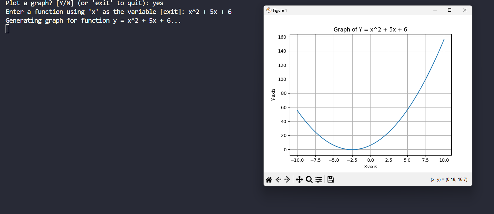

# 📈 Mini-GeoGebra: Calculator and Function Plotter



## 📄 Description

This project is a multi-purpose tool developed in Python that serves as both a command-line calculator and a plotter for single-variable mathematical functions (`x`). The goal is to provide a simple and user-friendly interface to perform quick calculations and visualize the behavior of different functions on a 2D graph.

This project was developed as part of my learning journey in Data Science and as a Mathematician, applying concepts of programming logic, string manipulation with Regex, and the use of fundamental libraries from the Python ecosystem.

## ✨ Key Features

- **Dual Mode:** Choose between using the tool as a direct expression calculator or as a function plotter.
- **Function Plotter:** Enter any function of `x` and instantly visualize its graph.
- **User-Friendly Syntax:** The parser accepts common shortcuts:
  - `x^2` for exponents (is converted to `x**2`).
  - `5x` for implicit multiplication (is converted to `5*x`).
- **Safe Evaluation:** Uses the `numexpr` library to evaluate expressions, avoiding the security risks of the `eval()` function.

## 🛠️ Tech Stack

- **Python**
- **NumPy:** For array generation and numerical computations.
- **Matplotlib:** For data visualization and plotting.
- **NumExpr:** For the safe evaluation of mathematical expressions.
- **Regex (`re` module):** For preprocessing and correcting user-input formulas.

## 🚀 How to Run This Project

To run this project on your local machine, follow the steps below:

1. **Clone the repository:**

   ```bash
   git clone [https://github.com/Silea-Dev/mini-geogebra.git](https://github.com/Silea-Dev/mini-geogebra.git)
   cd mini-geogebra
   ```
2. **Create a virtual environment (Recommended):**

   ```bash
   python -m venv venv
   source venv/bin/activate  # On Windows: venv\Scripts\activate
   ```
3. **Install the dependencies:**

   ```bash
   pip install -r requirements.txt
   ```
4. **Run the program:**

   ```bash
   python main.py
   ```

## 📈 Roadmap

- [ ] **v2.0:** Implement the plotting of multiple functions on the same graph.
- [ ] Add more graph customization options (colors, line styles).
- [ ] Allow the user to define the `x` range to be plotted.

## 📜 License

This project is licensed under the MIT License. See the `LICENSE` file for more details.
